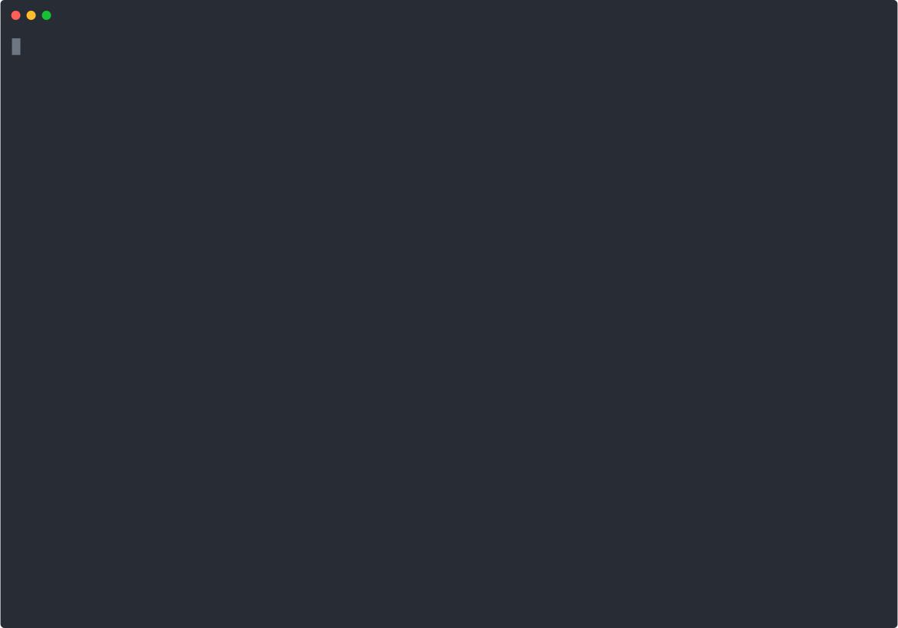

# Create EditorConfig

A simple npm script to generate an `.editorconfig` file.

You don't know EditorConfig? [Check out the official documentation!](https://editorconfig.org/)

## Usage

Simply run `npx create-editorconfig` in your project directory and answer
the prompted questions according to your preferences. You must have `node` and
`npm` installed.

Use `npx create-editor -y` to skip the prompts and generate a [default `.editorconfig`
file](.editorconfig).

## License

Create EditorConfig is open source software [licensed as MIT](https://github.com/facebook/create-react-app/blob/main/LICENSE).
